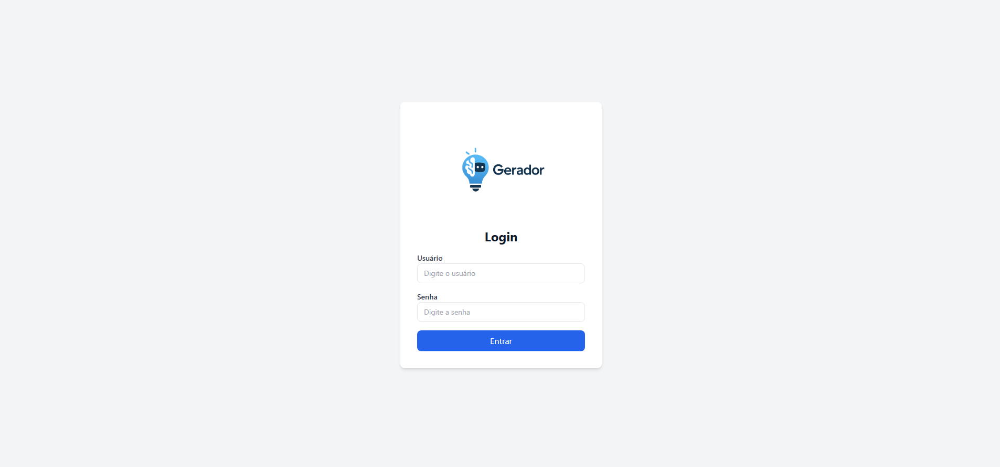
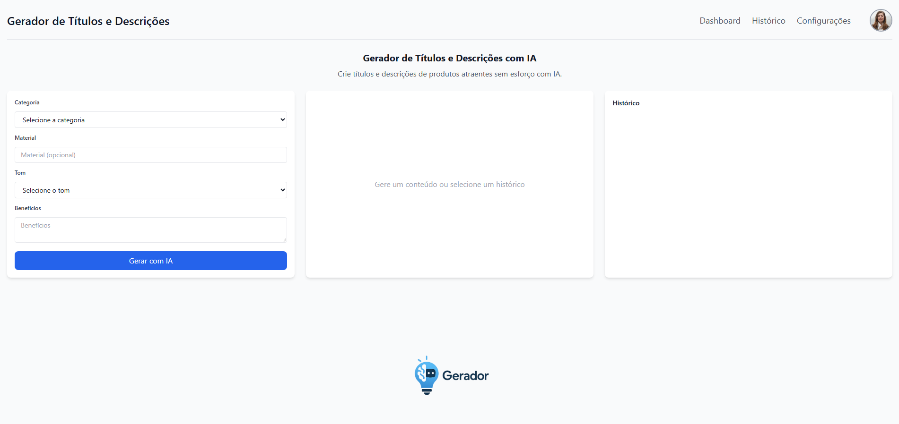
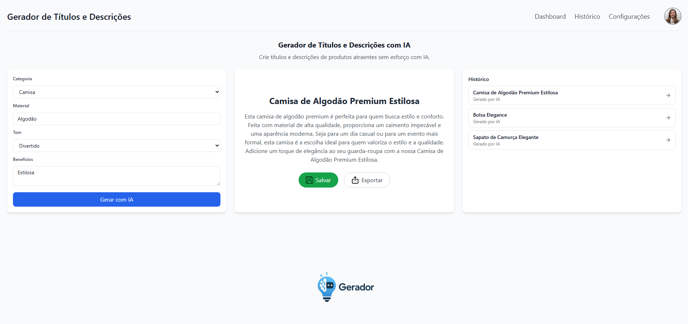

# 🚀 **Gerador de Títulos e Descrições com IA** ✨

## 🔥 **Crie títulos e descrições de produtos com Inteligência Artificial**

Este projeto permite gerar **títulos e descrições** automaticamente utilizando **Inteligência Artificial (IA)** de forma rápida, simples e eficiente.

---

## ⚙️ **Tecnologias Utilizadas**

- **React**: Desenvolvimento do front-end.
- **Tailwind CSS**: Estilização e responsividade do front-end.
- **FastAPI**: Desenvolvimento do back-end.
- **OpenAI (GPT-3.5)**: Motor de geração dos textos.
- **SQLite + SQLAlchemy**: Banco de dados leve e persistente para o histórico.
- **Docker e Docker Compose**: Containerização da aplicação.

---

## 🏗️ **Como Rodar o Projeto**

### 1. **Clonar o Repositório**

```bash
git clone https://github.com/CarlosViinicius/Gerador-de-Titulos-e-Descricoes-com-IA.git
cd Gerador-de-Titulos-e-Descricoes-com-IA
```

### 2. **Configurar as Variáveis de Ambiente**

Crie um arquivo `.env` dentro da pasta `backend/` baseado no arquivo `.env.example`:

```bash
# backend/.env
API_KEY=sua-chave-da-openai
BACKEND_URL=http://localhost:8000
```

### 3. **Rodar os Containers com Docker Compose**

Na raiz do projeto, execute:

```bash
docker-compose up --build
```

### 4. **Acessar a Aplicação**

- **Frontend**: [http://localhost:3000](http://localhost:3000)
- **Backend**: [http://localhost:8000/docs](http://localhost:8000/docs) (Swagger UI)

---

## 💡 **Funcionalidades**

- ✅ **Geração Automática**
- ✅ **Salvamento do histórico no banco SQLite**
- ✅ **Exclusão individual de itens do histórico**
- ✅ **Exportar para TXT**
- ✅ **Tela de Login**
- 🚧 **Dashboard, configurações e filtros (em breve)**

---

## 🖼️ Prints da Aplicação

### Tela de Login



### Tela Principal (vazia)



### Títulos e Descrições Gerados pela IA



---

## 📋 **Licença**

Este projeto está sob a licença MIT. Consulte o arquivo [LICENSE](LICENSE) para mais detalhes.

---

## 💬 **Contato**

- **Email**: carlosvendramini51@gmail.com
- **GitHub**: [@CarlosViinicius](https://github.com/CarlosViinicius)
